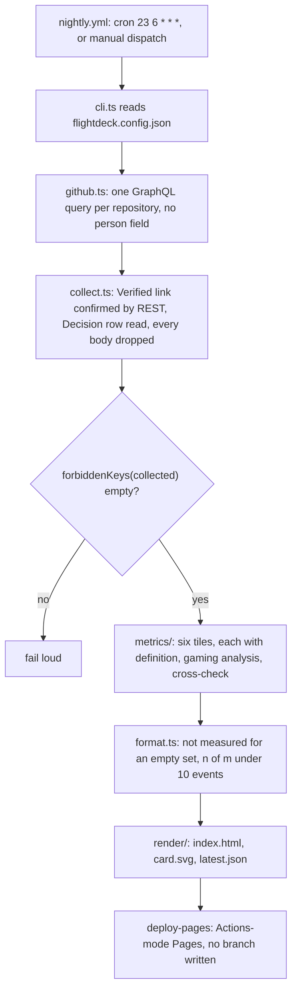

# flightdeck

Nightly delivery metrics for this portfolio, where every number ships with its
definition, the way it gets gamed, and the cross-check that exposes the
gaming.

> Claude writes the code in these repositories. I set direction, make every decision recorded in the ADRs, define what gets measured and how, review every pull request, and merge. The judgment is mine. The typing is not.

[](https://github.com/Ap-Standard/flightdeck/actions/workflows/checks.yml)
[](https://github.com/Ap-Standard/flightdeck/actions/workflows/nightly.yml)
[](LICENSE)

[](https://ap-standard.github.io/flightdeck/)

The card above will render from the first successful nightly run onward, at
`https://ap-standard.github.io/flightdeck/card.svg`, and the dashboard behind
it will live at `https://ap-standard.github.io/flightdeck/`. [pending first nightly]

Measured: two repositories, `twoseat` and `flightdeck`, over a 90-day window, read from the GitHub API by `src/cli.ts`; the first numbers will appear after the first nightly run. [pending first nightly]\
Method: [docs/metrics.md](docs/metrics.md) states each tile's definition, gaming analysis, and cross-check; `latest.json` beside the page carries the raw numbers.\
Not built: time to restore, no production service exists [not measured]; issue aging [cut at the line cap]; a second human reviewer [not built].

## What I own here

| | |
| --- | --- |
| **Decided** | A deployment is a verified release, not green CI ([ADR 0001](docs/adr/0001-a-deployment-is-a-verified-release.md)). Team-level only, enforced by two tests rather than a policy ([ADR 0002](docs/adr/0002-team-level-only-by-construction.md)). A tile over the line cap is cut, not squeezed in: issue aging ([docs/metrics.md](docs/metrics.md#issue-aging-cut-at-the-line-cap)). |
| **Specified** | Every tile ships with its definition, its gaming analysis, and its cross-check, or it does not ship. An empty set prints "not measured" and a rate under 10 events prints as a count. |
| **Measured** | LINE_COUNT lines of code, tests, workflows, and config by `git ls-files src test .github package.json tsconfig.json vitest.config.ts eslint.config.js flightdeck.config.json .gitleaks.toml \| xargs wc -l` on 2026-09-05, against a hard cap of 1,100. TEST_COUNT tests passing by `npx vitest run` on the same day, with no network and no token. `dependencies` in `package.json` is `{}`. |
| **Reviewed** | Every pull request, by twoseat at `v0.1.0`, comment-only ([ai-review.yml](.github/workflows/ai-review.yml)). Merged pull requests on 2026-09-05 by `gh pr list -R Ap-Standard/flightdeck --state merged`: 0; the first will be the one that carries this file. [pending first merge] The gate's own limits: zero findings on live pull requests so far ([twoseat #12](https://github.com/Ap-Standard/twoseat/issues/12)), and synthetic benchmark scores are an upper bound ([twoseat REPORT.md](https://github.com/Ap-Standard/twoseat/blob/main/bench/results/REPORT.md)). |

## Run it

```bash
npm ci && npm test && npx tsx src/cli.ts --fixtures
```

Renders `site/index.html`, `site/card.svg`, and `site/latest.json` offline
from `test/fixtures/` with no token, through the same code path the nightly
workflow runs against the live API.

## How a night becomes a number



## Results and method

No number the dashboard carries is copied into this file, so this file cannot
go stale against it. Definitions, gaming analysis, and
cross-checks: [docs/metrics.md](docs/metrics.md). After the first nightly run
the dashboard will show six tiles: verified releases, lead time, gate-bypass
rate, change failure, measurement reliability, and time to restore. [pending first nightly]

## Limitations

- **[pending first nightly]** No live data yet. This file was written before
  the first nightly run; the sentences carrying this tag get rewritten after
  the first week of real data.
- **[not measured]** Time to restore. No production service exists; the tile
  prints "not measured" and carries the definition that activates on the first
  regression.
- **[cut at the line cap]** Issue aging. Defined in
  [docs/metrics.md](docs/metrics.md), not computed.
- **[documented]** Last 100 merged pull requests and last 50 releases per
  repository, per query. The cap is stated in the dashboard footer.
- **[documented]** Change failure counts `type:bug` pull requests within 7
  days of a verified release, not incidents. A proxy, printed as a count.
- **[documented]** A solo maintainer merges. The gate-bypass tile measures
  whether the review gate was honored, not whether a second person agreed.
- **[pending]** Cross-repository reads with the run's own `GITHUB_TOKEN`,
  confirmed on the first dispatch. The fallback is a fine-grained read-only
  token, documented in [docs/runbook.md](docs/runbook.md).
- **[by design]** Nightly, not real time. The card prints its generation date.
- **[by design]** Two repositories measured, `twoseat` and `flightdeck`.
  Adding one is a config line and a fixture entry.

## Decisions

- **A deployment is a verified release.**
  [docs/adr/0001](docs/adr/0001-a-deployment-is-a-verified-release.md).
- **Team-level only, by construction.**
  [docs/adr/0002](docs/adr/0002-team-level-only-by-construction.md).
- **A tile over the cap is cut.** The hard cap is 1,100 lines by `wc -l` over
  `src`, `test`, `.github`, and the config files, printed in every pull
  request. Issue aging went over and was cut; its definition stays in
  [docs/metrics.md](docs/metrics.md).
- **The reliability denominator starts at the first run.** Nights before the
  workflow existed are not misses; the tile counts nights since its first
  listed run, capped at 30, and says so.
- **Unverified reasons are the printed sentences.** The detector's reason
  string is the text the page prints, so the code path and the cross-check
  cannot disagree.
- **Bodies never leave `collect.ts`.** Read for the Decision row and the
  Verified link, then dropped. A test asserts the collected JSON holds no
  `body`, `comments`, or `description` key.

## Runbook

[docs/how-it-works.md](docs/how-it-works.md), one page, then
[docs/runbook.md](docs/runbook.md): dispatch, re-enable after GitHub's 60-day
inactivity disable, the token fallback, adding a repository, and what a failed
nightly looks like.

## Changelog

[CHANGELOG.md](CHANGELOG.md). No release yet; the nightly badge stands in for
a release badge until the first one. [pending first release]

## License

[Apache-2.0](LICENSE).
